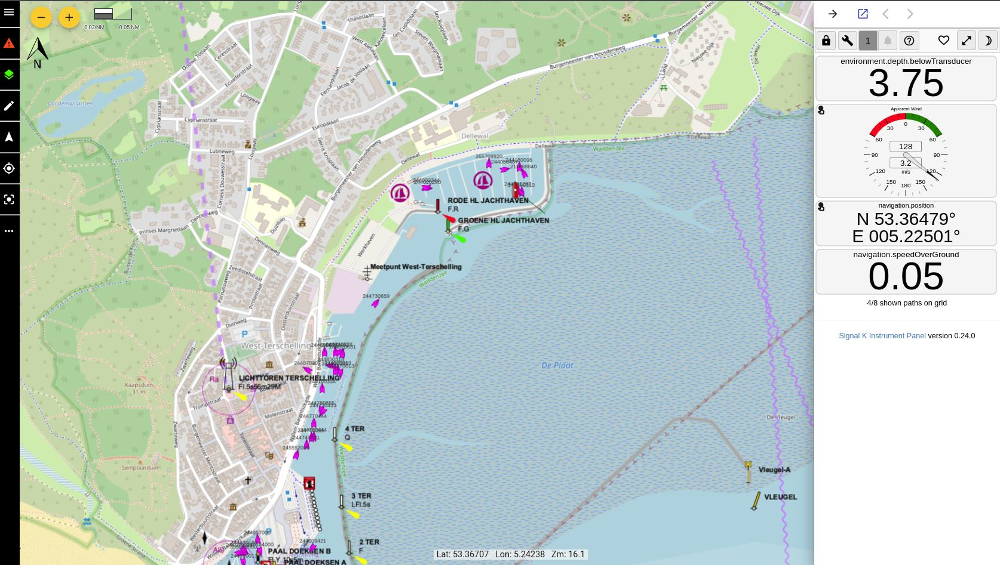

# signalk-server-go

Start of a [signal K](https://signalk.org/specification/1.7.0/doc/) server implemented in go 

First only a n2k can source will be implemented with a subset of [canboat](https://signalk.org/specification/1.7.0/doc/) supported PGN's 


## Dependencies

go 1.20

Additional for s57-tiler GDAL is needed, tested with GDAL 3.6.2

## Get started

### signalk-server-go

Get the webapps [Freeboard-sk](https://github.com/SignalK/freeboard-sk) and [Instrumentpanel](https://github.com/SignalK/instrumentpanel)

```
$ make webapps
```

```
$ make build
```
or
```
$ make buildarm
```
For a ARMv6 target

Run the server
```
$ ./build/signalk-server-go --file-source samples/nemo-n2k.txt
```

Point a browser at [http://localhost:3000/](https://localhost:3000/)




For live data with a can device with socketcan support

```
./build//signalk-server-go --source can0
```

If you have an AIS connected to the N2K network

```
./build/signalk-server-go --mmsi <mmsi number> --source can0
```

More options

```
$ build/signalk-server-go --help
Usage of build/signalk-server-go:
  -debug
        Enable debugging
  -file-source value
        Path to candump file
  -mmsi string
        Vessel MMSI
  -port int
        Listen port (default 3000)
  -source value
        Source Can device
  -tls
        Enable tls
  -tlscert string
        Tls certificate file
  -tlskey string
        Tls key file
  -version
        Show version
  -webapp-path string
        Path to webapps (default "./static")
  -webapps
        Serve webapps (default true)
```

### s57-tiler

S57-tiler creates vectortiles from S57 ENC's wich can be used with freeboard-sk with s57 support see [https://github.com/wdantuma/freeboard-sk/tree/feat-S57-support](https://github.com/wdantuma/freeboard-sk/tree/feat-S57-support)

```
make builds57tiler
```

```
./build/s57-tiler --in <path to directory tree container catalog.031 files> --out ./static/charts
```

More options
```
$ build/s57-tiler --help
Usage of build/s57-tiler:
  -at string
        lon,lat
  -bounds string
        W,N,E,S
  -in string
        Input path S-57 ENC's (default "./charts")
  -maxzoom int
        Max zoom (default 14)
  -minzoom int
        Min zoom (default 14)
  -out string
        Output directory for vector tiles (default "./static/charts")
```
